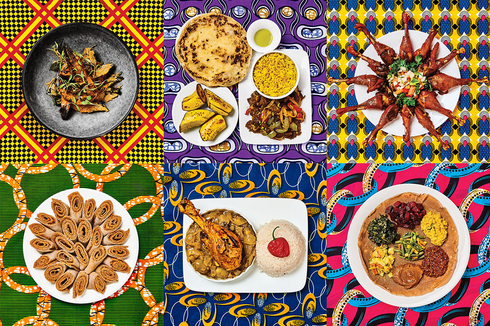
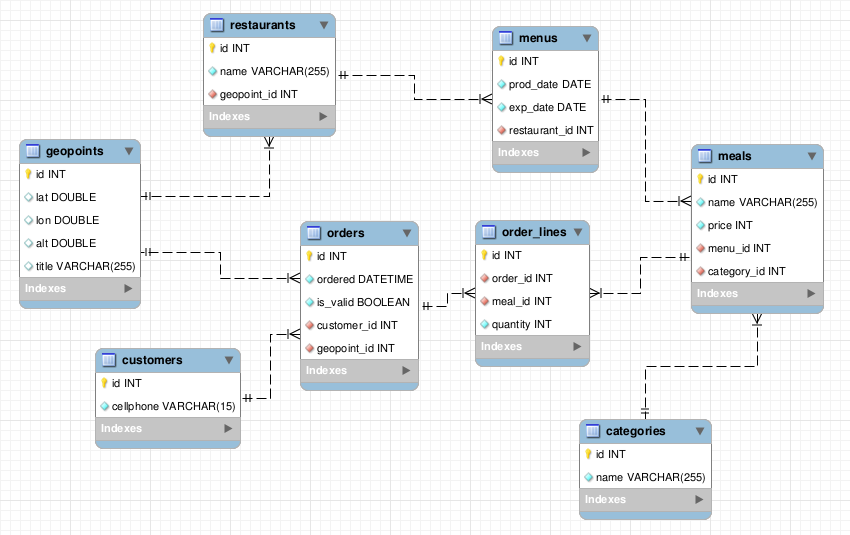

# RestAPIChallenge
RESTful API for the management of the orders in the restaurant mobile application MonMenu by Suite 2.0

## Environnement
### OS
Ubuntu

### Programming language
Python 3.5

### Frameworks
Django 1.11.7
DjangoRestFramework 3

### Editor
Visual Studio Code 1.18.1

## Database diagramme

